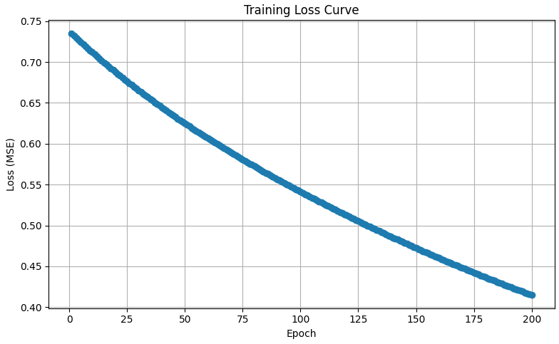
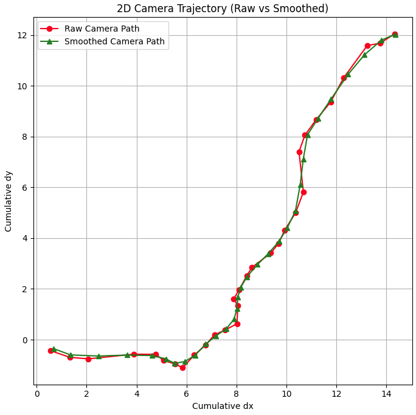
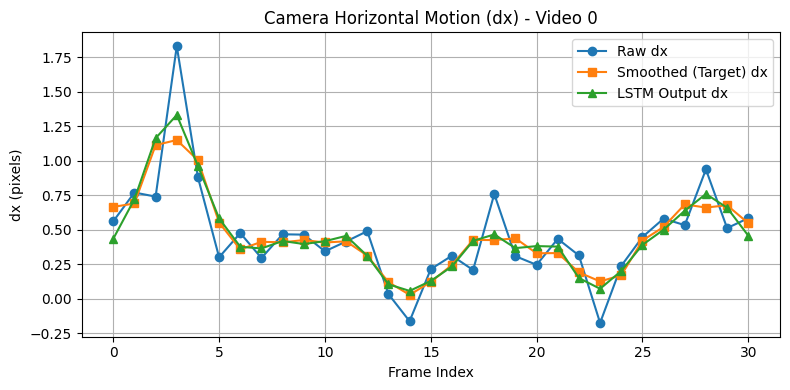
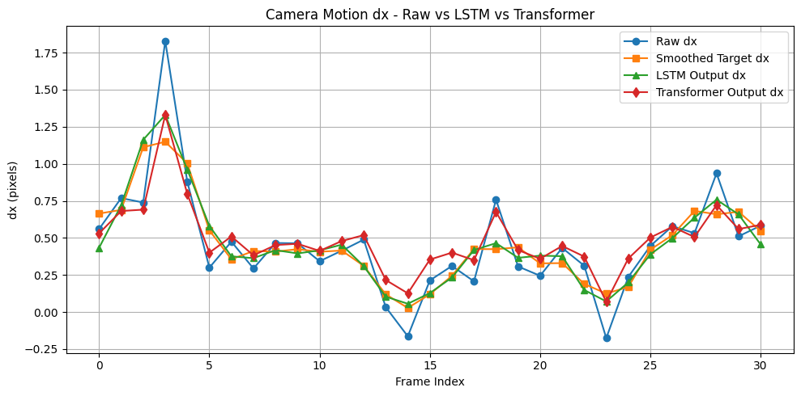

# Deep Learning Based Video Stabilization (RAFT + BiLSTM/Transformer/GRU)

[📄 Project Report (PDF)](docs/VideoStabilization.pdf) • [🌐 Project Website](https://tarungangadhar.github.io/VideoStabilizationWebsite/) • [Colab](https://colab.research.google.com/drive/1WUPANk4GPu7wTVZ4NPrncu9QODDZP1Z0?usp=sharing)
---

## Abstract
We learn to smooth camera motion directly from **optical flow**. Dense flow is estimated using **RAFT** on UCF101/DAVIS videos; frame-to-frame flow is reduced to a mean 2D vector (dx, dy) per step. A **BiLSTM** (and baselines: **Transformer**, **GRU**) is trained to predict a smoothed motion sequence supervised by a local moving-average target. Models reduce temporal jitter and yield smoother trajectories and visual comparisons (GIF/MP4). 

## Method
1. **Datasets**: UCF101 (AVI) and DAVIS-2017 (JPEG frames). Frames are resized to 256×256; sequences trimmed to ~31–32 steps. 
2. **Optical Flow**: **torchvision** RAFT (pretrained) estimates dense flow between consecutive frames; we take the **mean flow** over pixels → (dx, dy). 
3. **Targets**: a **3-frame moving average** creates the smoothed supervision signal. Variable-length sequences are **padded** with a mask for loss. 
4. **Models**:  
   - **BiLSTM** (2×32 hidden, FC → 2D)  
   - **Transformer** encoder (2→64 proj, PE, 3 layers, 4 heads, dropout 0.1, proj → 2D)  
   - **GRU** (32 hidden, FC → 2D) 
5. **Training**: MSE with mask on valid timesteps; Adam (1e-3 LSTM/Transformer; 1e-2 GRU); ~150–200 epochs. 

## Results (summary)
- BiLSTM achieves the **best masked MSE** among the three; GRU is close; Transformer sometimes over-smooths but is competitive.  
- **Variance reduction** from raw to smoothed motion ≈ 1.5× (example from report).  
- Qualitative: smoother 2D trajectory curves and visibly steadier side-by-side videos/GIFs. 

| Loss Curve | 2D Trajectory |
|---|---|
|  |  |

| dx/dy (BiLSTM) | Model Comparison |
|---|---|
|  |  |

